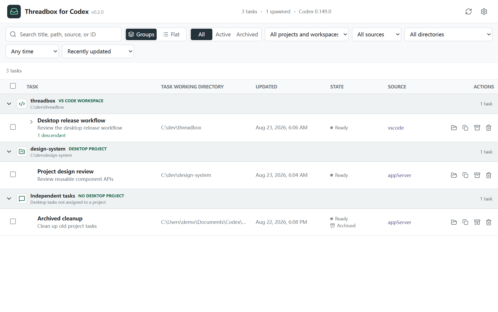

# Threadbox for Codex

**A local, cross-platform desktop manager for Codex tasks.**

[简体中文](README.zh-CN.md)



Threadbox brings Codex CLI and desktop task history from every working directory into one searchable list. It uses the official [Codex App Server](https://learn.chatgpt.com/docs/app-server) for every task operation. An explicitly confirmed repair tool can remove orphaned rows from Codex desktop's derived Recents catalog after creating and verifying a backup; it never edits task state, JSONL rollouts, or project files.

> Threadbox for Codex is an independent community project. It is not affiliated with or endorsed by OpenAI.

## Features

- List active and archived tasks across all working directories.
- Search titles, previews, paths, sources, and task IDs.
- Group desktop chats by Project, VS Code and CLI chats by working directory, and projectless desktop chats as independent tasks.
- Switch between grouped and flat views, and filter by project/workspace, archive state, source, directory, or recent activity.
- Archive, unarchive, and permanently delete one or many tasks.
- Optionally move selected working directories to the system Trash while keeping other project files.
- Group spawned sub-agent tasks under collapsible parent rows and avoid duplicate cascade deletion requests.
- Protect running tasks and require an explicit irreversible-deletion acknowledgement.
- Warn when other Codex processes may make cross-process running status incomplete.
- Detect and repair Codex desktop Recents entries whose underlying tasks have already been deleted.
- Open the original working directory or copy a task ID.
- English and Simplified Chinese interface with system light/dark themes.

Everything runs locally. Threadbox has no telemetry, does not call a model, and does not upload or retain conversation content.

## Requirements

- Windows 10/11, macOS, or a modern Linux desktop.
- Codex CLI `0.149.0` or newer available on `PATH`.

### Platform validation

| Platform | Current validation |
| --- | --- |
| Windows 10/11 x64 | Automated tests, packaged-app smoke tests, and manual use |
| macOS x64/arm64 | Automated tests and unsigned package builds in GitHub Actions; physical-device testing is still needed |
| Linux x64 | Automated tests and unsigned package builds in GitHub Actions; physical-device testing is still needed |

Install or update Codex CLI:

```bash
npm install -g @openai/codex@latest
```

You can also select a custom Codex executable in Threadbox settings or set `CODEX_BINARY`.

## Install

Download the package for your platform from [GitHub Releases](https://github.com/iris-Neko/codex-threadbox/releases).

- **Windows:** run the NSIS installer or unpack the ZIP build. Unsigned builds may trigger SmartScreen; inspect the publisher and release checksum before choosing **More info > Run anyway**.
- **macOS:** open the DMG or ZIP build. Unsigned builds may require right-clicking the app and choosing **Open**, or approving it in **System Settings > Privacy & Security**.
- **Linux:** install the DEB package or mark the AppImage executable and launch it.

Every release includes `SHA256SUMS.txt`.

## Safety model

Permanent deletion calls App Server `thread/delete`, which also deletes spawned descendants. Threadbox refreshes the inventory immediately before deletion, removes active or pinned tasks from the request, collapses selected descendants under selected parents, and executes root deletions sequentially so one failure does not stop the rest.

Project files are kept by default. The deletion dialog lists the exact task `cwd` values shown in the table, not project/workspace group names. Only checked directories are moved to the operating system Trash, and only after the corresponding task deletion succeeds. Threadbox keeps filesystem roots, the user home and Codex data directories, system locations, its own application paths, and directories still referenced by remaining Codex tasks. Trash failures never trigger permanent filesystem deletion.

Codex `0.149.0` does not yet expose pin metadata in its stable App Server schema. Threadbox keeps pin controls capability-gated and enables them only when the installed stable CLI advertises the required API. It never works around a missing task API by modifying Codex task state files.

Runtime status belongs to an App Server process, so a separate Threadbox process cannot guarantee that it sees work running inside another Codex desktop or IDE process. Threadbox displays a warning whenever other Codex processes are detected.

Codex desktop also keeps a separate derived `local_thread_catalog` for its Recents sidebar. Cross-process App Server deletion can leave orphaned rows in that catalog even though the task and rollout are gone. Threadbox compares the catalog with a freshly paged App Server inventory and offers a separate confirmation before removing only orphaned local-host rows. Before changing the catalog it creates a timestamped SQLite online backup under `~/.codex/backups_threadbox/desktop-recents` and verifies the backup with `PRAGMA integrity_check`. It does not alter cloud-host rows, task state databases, rollout files, or working directories during this repair.

## Development

Prerequisites: Node.js 22+ (Node.js 24 is used in CI) and npm.

```bash
npm install
npm run dev
```

Validation commands:

```bash
npm run lint
npm run typecheck
npm test
npm run test:integration
npm run test:e2e
npm run package
```

The integration test creates an isolated temporary `CODEX_HOME`. Unit and Electron tests use a fake stdio App Server. Tests never mutate real Codex tasks.

Regenerate protocol types from the pinned Codex development dependency:

```bash
npm run protocol:generate
```

See [Architecture](docs/ARCHITECTURE.md) and [Contributing](CONTRIBUTING.md) for project details.

## Scope

Threadbox intentionally excludes full transcript viewing/export, task-database repair, automatic CLI upgrades, and a bundled Codex CLI. Recents repair is limited to the disposable desktop sidebar catalog described above.

## License

[MIT](LICENSE)
